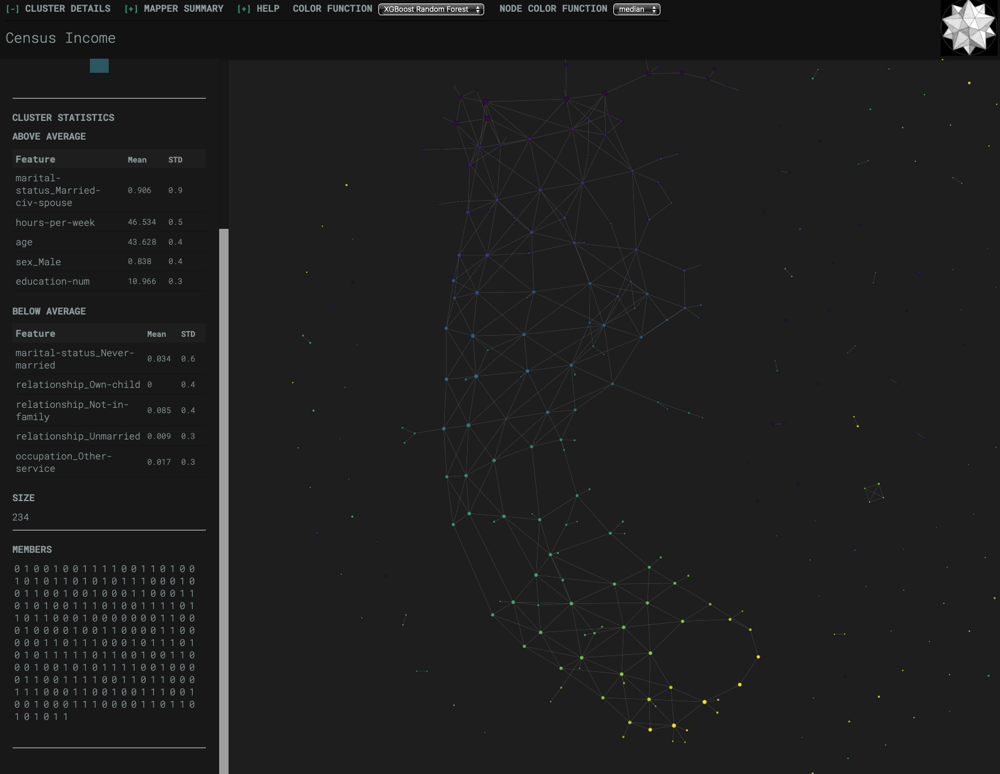
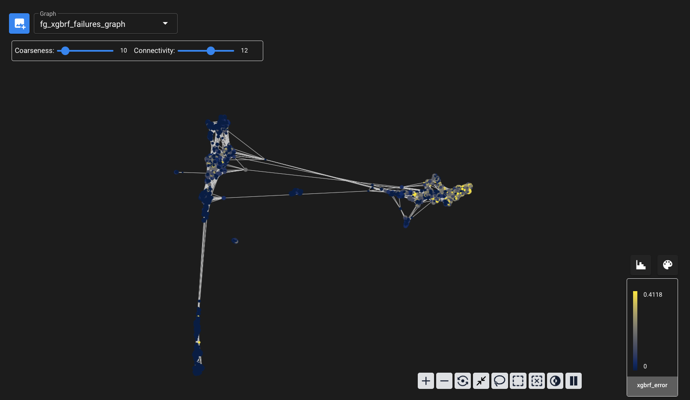

# census_income
THE SHAPE OF 1994 US CENSUS BUREAU INCOMES FROM THE UC-IRVINE MACHINE LEARNING REPOSITORY

Abstract

Topological data analysis (TDA) is a group of methods and techniques that can be used in the context of both exploratory and explanatory data analysis. The Kepler Mapper algorithm from Scikit-TDA is applied to the training set and its predictions as output by an XGBoost classifier evaluated on a validation set to investigate how well the baseline model performs on the target of interest (i.e., earning <= $50K or > $50K) and to visualize those areas where it might misclassify out-of-sample results before utilizing any testing set data to make such determinations. The goal for the analyst is to have a prior understanding of the salient discriminative variables and the potential confounding variables to guide early model development. For comparison, the Cobalt package from BluelightAI is applied to the full data from the training, validation, and testing sets to see what additional information can be gained about the model errors using a *post hoc* approach. Other suggested improvements to the baseline model include categorical feature embeddings, probability calibration, and decision threshold tuning.

Figure 1. XGBoost model error mapping on training set using Scikit-TDA package (see: https://github.com/scikit-tda)

Figure 2. XGBoost model error mapping on training, validation, and testing sets using Cobalt package (see: https://github.com/BlueLightAI)

Dataset Citation:

Becker, B. and R. Kohavi. "Census Income," UCI Machine Learning Repository, 1996. [Online]. Available: https://doi.org/10.24432/C5GP7S.